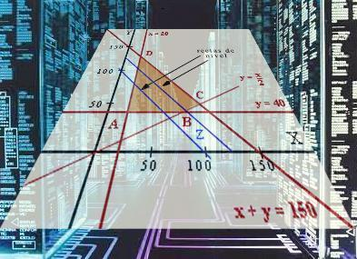

## PÁGINA DE PROGRAMACIÓN LINEAL
En está página voy a mostrar muchas de las cosas que estoy aprendiendo en mi curso de Programación Lineal en la LIMA. 

## Sympy

Aprendimos a usar la biblioteca Sympy.

## Enlaces

- [Enlace python](https://blog.python.org/)
- [Enlace Google](https://www.google.com/)
- [Enlace Github](https://github.com/VeraniaHdez12/Programacion-Lineal)

## Problemas
Maximizar

$$z=x_1+x_2$

Sujeto a

$$x_1 \geq 0$$